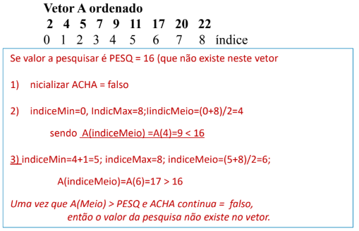
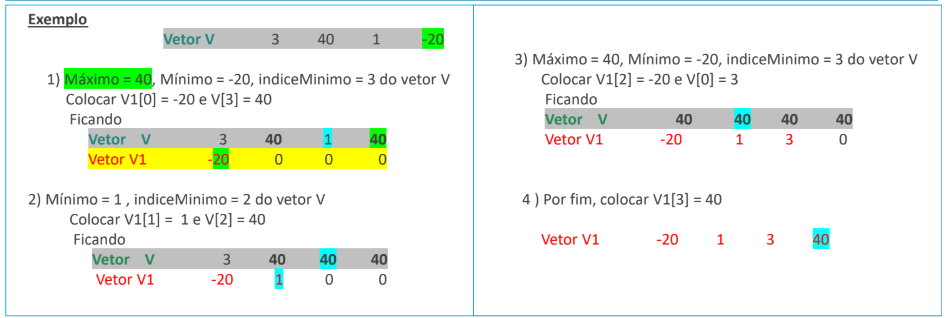
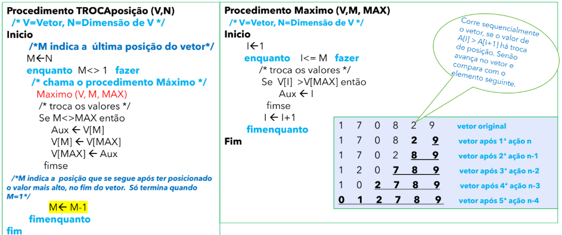
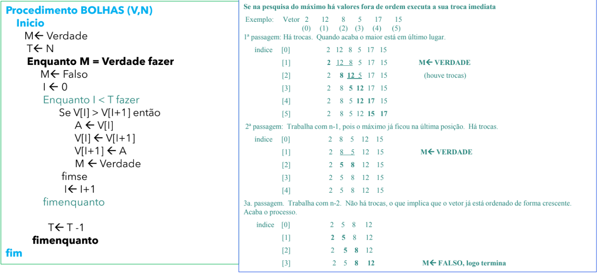

# Aula 4 - Vetores: Ordenação e pesquisa
- **Pesquisa binária ou dicotómica**
    - Um vetor com n elementos, ordenado, V[0...n-1], sendo o seu **indiceMin = 0** e o seu **indiceMax = n - 1**. Para fazer a pesquisa binária, temos que calcular a posição do meio, para comparar com o valor a pesquisar.
        1. Calcular a posição do **indiceMeio = (indiceMin + indiceMax) / 2**, **arredondando para baixo** para que seja um inteiro
        2. **Se o valor de A for maior do que o valor de V[indiceMeio], recalculamos o indiceMeio, substituindo o indiceMin pelo indiceMeio**
        3. **Se o valor de A for menor do que o valor de V[indiceMeio], recalculamos o indiceMeio, substituindo o indiceMax pelo indiceMeio**
        4. **Voltar ao 1º passo até** encontrarmos o valor de A. **A = V[indiceMeio]**
        5. **Se indiceMin > indiceMax, A não foi encontrado no vetor V**

- **Ordenação - Método dos Mínimos Sucessivos**
    - Dado um vetor V, obtém-se um novo vetor V1, ordenado de forma crescente
        1. Detetar o **Máximo de V**
        2. **Determinar o mínimo e o índice do Mínimo de V**
        3. **Inserir o mínimo na primeira posição de V1**
        4. **Substituir o valor de V[indiceMinimo] pelo Máximo de V**
        5. **Repetir passos 2, 3 e 4 até V1 estar completamente preenchido**

      

- **Ordenação - Método dos Máximos Sucessivos**
    - Consiste em encontrar o valor máximo e trocar este valor com o elemento do fim
    - Repetir a ação mas com a dimensão n-1, enquanto n <> 1.

- **Ordenação de um vetor pelo Método de Bolhas**
    - Na pesquisa do Máximo se há valores fora de ordem, executa a sua troca imediata.

- **Quadros (Matrizes)**
    - **Um quadro é uma estrutura em tabela multidimensional nxm** usada para conter dados estruturados, **composta por linhas e colunas**.
    - **Cada coluna representa um tipo de dados/informação**. As várias colunas representam tipos de informação diferentes.
    - **As linhas têm todas o mesmo número de colunas e o mesmo tipo de dados/informação por coluna**.
    - Os dados armazenados podem ser numéricos ou alfanuméricos de várias dimensões. Uma vez criado um quadro de dados, podemos aplicar várias operações de quadro de dados.
    - **A dimensão e a ordem de um quadro revelam por completo a sua estrutura**.
    - Uma matriz de duas dimensões está sempre a fazer referência a linhas e colunas e é representada pelo seu nome e pela sua dimensão.