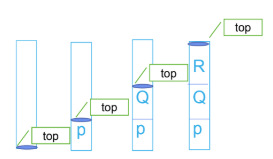
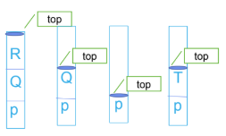
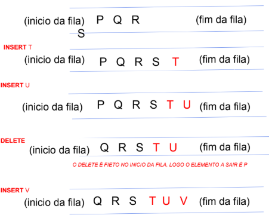

# Pilhas e Filas
Pilhas e filas são:
- ADT (Abstract Data Type) que contém elementos em ordem linear.
- Operações de inserir ou de remover só podem ser executadas num dos extremos da lista.
- Não é possível remover ou inserir no meio destas estruturas.

## Pilhas (Stack)
- Inserção, remoção de elementos só é possível numa extremidade.
- **LIFO (Last IN, First OUT)**

### Inserção - PUSH
**Lista de procedimentos**:
- Pilha vazia
- Adicionar 1º elemento: Push P
- Adicionar 2º elemento: Push Q
- Adicionar 3º elemento: Push R
- Pilha cheia

Quando a pilha está cheia e executa-se a operação Push, diz-se que a pilha está com **OVERFLOW**.

### Remoção - POP
**Lista de procedimentos**:
- Pilha cheia
- Remover 1º elemento: Pop R
- Remover 2º elemento: Pop Q
- Adicionar 4º elemento: Push T

Quando a pilha está vazia e executa-se a operação Pop, diz-se que a pilha está com **UNDERFLOW**.

## Filas (Queues)
- Inserção de elementos é feita numa extremidade da lista.
- Remoção de elementos é feita na outra extremidade da lista.
- **FIFO (First IN, First OUT)**

