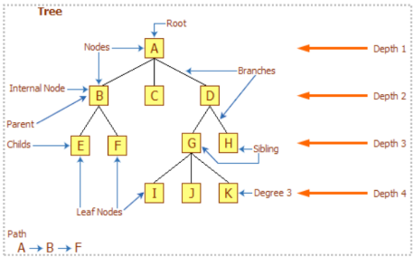
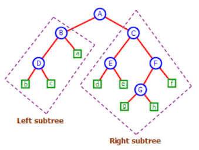
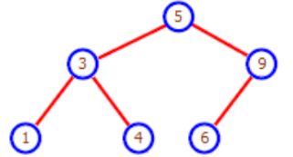
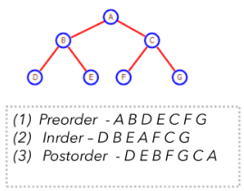
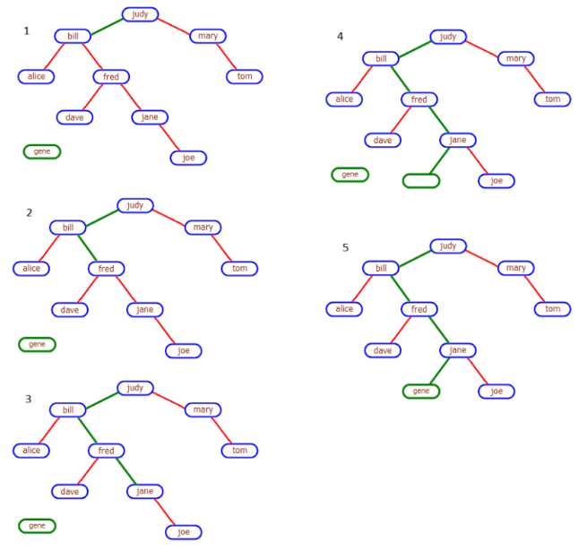
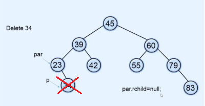
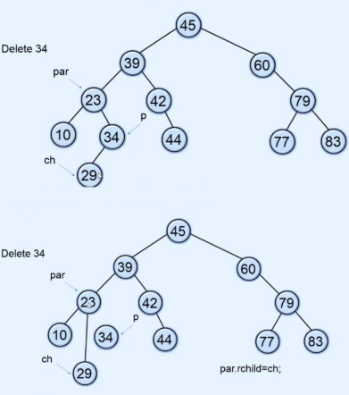
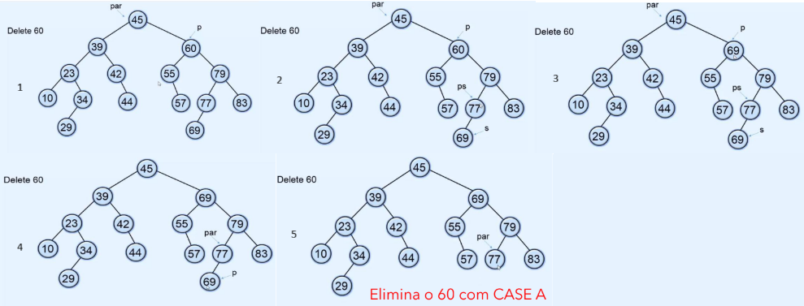
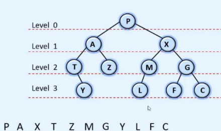
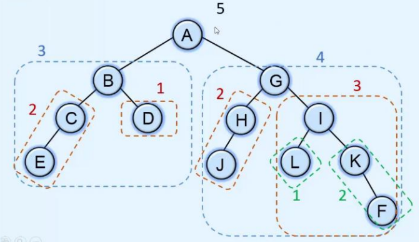

# Árvores Binárias
- São estruturas **não lineares**, ao contrário das listas encadeadas e dos arrays.
- Representam uma estrutura **hierárquica**, com relações entre os seus elementos (formam uma hierarquia natural, como o sistema de arquivos do computador).
- Uma árvore pode ter uma ou várias sub-árvores (sub-trees).
- Cada elemento da árvore é um NÓ (Node).
- **Branches** - é uma ligação entre 2 nós.
- **Path** (percurso) - é o caminho entre 2 nós distintos. Esse caminho é determinado com base numa condição específica.
- **Root Node (Raiz)** - é um nó que não tem nenhum nó precedente.
- **Parent Node** (Ascendente ou Pai) - Precede um nó.
- **Child Node** (Descendente ou Filho) - Sucede imediatamente um nó.
- **Left Node** (folha) - Nós que não precedem qualquer tipo de nó.
- **Degree (grau)** - Corresponde ao número de descendentes que esse nó tem. O grau de uma árvore é o maior grau de todos os nós descendentes dessa árvore.
- **Siblings (irmãos)** - 2 ou mais nós têm o mesmo pai.



## Representação
Uma árvore binária (**grau 2** - cada nó tem no máximo dois nós como descendentes) é criar uma estrutura em que cada nó tem associado dois pointers.
```csharp
class BinaryNode
{
    public int item;
    BinaryNode leftChild;
    BinaryNode rightChild;
}
```

Uma árvore ternária (**grau 3** - cada nó tem no máximo três nós como descendentes) é criar uma estrutura em que cada nó tem associado três pointers.
```csharp
class TreeNode
{
    public int item;
    TreeNode leftChild;
    TreeNode middleChild
    TreeNode rightChild;
}
```

Uma árvore, para ser considerada binária, tem de ter as seguintes características:
1. Só pode haver um único node que não tenha Parent, o *root node*.
2. Todos os nodes na árvore têm apenas um único Parent.
3. Não podem existir ciclos entre os elementos de uma árvore, ou seja, não é possível, a partir de um node, seguir uma sequência de pointers e voltar ao mesmo pointer.

De modo recursivo, também podemos definir uma árovre binária como:
- Uma estrutura vazia, representada por manter um pointer com o valor NULL. Corresponde a uma leaf (external node).
- Um node (internal node) onde os left e right pointers endereçam uma árvore binária cada um (left subtree e right subtree)



## Binary Sort Tree
As árvores binárias permitem guardar listas ordenadas de qualquer tipo de dado, de uma forma que tornam qualquer pesquisa, quer a inserção, quer a pesquisa ou ainda a remoção, muitos eficientes.

Uma árvore binária usada deste modo é designada por **Binary Sort Tree** ou **Binary Search Tree (BST)**.



BST é um tipo de árvore binária onde os nodes são ordenados de acordo com a seguinte regra:
- Por cada node na árvore, o item nesse node é >= que qualquer item da left subtree respectiva e é < que todos os itens da right subtree.
- Ex: Esta árvore é uma BST, contendo itens do tipo inteiro.
- Node root tem o valor 5
- Nodes na left subtree (1,3,4) são <= que o Node root (5).
- Nodes na right subtree (6,9) são > que o Node root (5).
- De forma recursiva, para cada subtree, a regra também se aplica. Ex: Na subtree (1,3,4), o node root tem o valor 3 e 1 <= 3 e 4 > 3.

Uma árvore binária ou está vazia ou tem as seguintes propriedades:
1. Todas as chaves da *left subtree* são inferiores às chaves da *right subtree*.
2. Todas as chaves da *right subtree* são maiores do que as chaves da *left subtree*.
3. As raízes da *left* e *right* subtrees também são *binary search trees*.

### Tree Traversal
Aceder a cada um dos nodes de uma árvore é designado por **traversing the tree**.
Existem várias hipóteses de sequência para aceder aos nodes de uma árvore binária. Três destas hipóteses são:
- **Preorder** - Para aceder em modo preorder, deve-se seguir a seguinte sequência:
    1. Aceder ao node.
    2. Recursivamente, aceder à left subtree, em modo preorder.
    3. Recursivamente, aceder à right subtree, em modo preorder.
- **Inorder** - Para aceder em modo inorder, deve-se seguir a seguinte sequência:
    1. Recursivamente, aceder à left subtree, em modo inorder.
    2. Aceder ao node.
    3. Recursivamente, aceder à right subtree, em modo inorder.
- **Postorder** - Para aceder em modo postorder, deve-se seguir a seguinte sequência:
    1. Recursivamente, aceder à left subtree, em modo postorder.
    2. Recursivamente, aceder à right subtree, em modo postorder.
    3. Aceder ao node.



### Localizar e inserir numa BST
Neste exemplo, vamos inserir o elemento *"gene"*. Para fazer isto, relembrar que:
1. Left Subtree contêm valores **inferiores** ao root.
2. Right Subtree contêm valores **superiores** ao root.
3. Se *"gene"* é menor que a chave a ser verificada, vai para o filho **esquerdo**.
4. Se *"gene"* é maior que a chave a ser verificada, vai para o filho **direito**.
5. Se *"gene"* for igual á chave a ser verificada, a chave é **duplicada**.
6. Quando chegarmos a um filho **null**, fazemos a inserção.


**Lista de Procedimentos**:
1. *"gene" <= "judy"* - Verdadeiro. Vai para a left subtree.
2. *"gene" <= "bill"* - Falso. Vai para a right subtree.
3. *"gene" <= "fred"* - Falso. Vai para a right subtree.
4. *"gene" <= "jane"* - Verdadeiro. Vai para a left subtree.
5. Como *"jane"* não contêm um left child, *"gene"* vai ser inserido.

### Remover numa BST
Existem 3 casos para fazer um delete de uma BST:
1. Node não tem filhos - É um **leaf node**.
2. Node tem **1 filho**.
3. Node tem **2 filhos**.

Para referência:
**P - Node a apagar**
**PAR - Pai do node a apagar**
**CH - Filho do node a apagar**

#### Caso 1 - Leaf Node
Como o node a apagar é um **Leaf Node** (não tem filhos), não existem complicações.


#### Caso 2 - 1 Filho
Como o node a apagar tem 1 filho, o filho vai substituir o pai.

Se P for filho esquerdo do PAR, CH vai tornar-se no filho esquerdo do PAR.
Se P for filho direito do PAR, CH vai tornar-se no filho direito do PAR.


#### Caso 3 - 2 Filhos
Para apagar um node com 2 filhos, temos que:
1. Encontrar o sucessor inorder da node a apagar.
2. Copiar a data do sucessor.
3. Apagar o sucessor, usando o caso 1 ou 2.

Para referência:
**PS - Parent Sucessor**
**S - Sucessor**


**Lista de Procedimentos**:
1. Node a apagar: 60. Tem 2 filhos.
2. Encontrar o sucessor inorder: 10 23 29 34 39 42 44 45 55 57 60 **69** 77 79 83
3. Copiar a data do sucessor para o node a apagar.
4. Apagar o sucessor (tem 0 filhos - Caso 1).

## Métodos C#
### PreOrder
**Preorder - Node, Left, Right**
```csharp
public void Preorder()
{
    Preorder(root);
    Console.WriteLine();
}

private void Preorder(Node p)
{
    if (p == null) 
        return;
    Console.Write(p.info + " ");
    Preorder(p.lchild);
    Preorder(p.rchild);
}
```

### InOrder
**Inorder - Left, Node, Right**
```csharp
public void Inorder()
{
    Inorder(root);
    Console.WriteLine();
}

private void Inorder(Node p)
{
    if (p == null)
        return;
    Inorder(p.lchild);
    Console.Write(p.info + " ");
    Inorder(p.rchild);
}
```

### PostOrder
**Postorder - Left, Right, Node**
```csharp
public void Postorder()
{
    Postorder(root);
    Console.WriteLine();
}

private void Postorder(Node p)
{
    if (p == null)
        return;
    Postorder(p.lchild);
    Postorder(p.rchild);
    Console.Write(p.info + " ");
}
```

### LevelOrder
Usando uma fila, temos:
1. Inserir a raiz (root node) na fila.
2. Remover um nó (node) da fila e acedê-lo.
3. Inserir o "left child" do nó que acabámos de aceder na fila.
4. Inserir o "right child" do nó que acabámos de aceder na fila.
5. Repetir 2,3 e 4 até que a árvore esteja vazia.


```csharp
public void LevelOrder()
{
    if (root == null)
    {
        Console.WriteLine("Tree is empty");
        return;
    }

    Queue<Node> que = new Queue<Node>();
    que.Enqueue(root);

    Node p;
    while (que.Count != 0)
    {
        p = que.Dequeue();
        Console.Write(p.info + " ");
        if (p.lchild != null)
            que.Enqueue(p.lchild);
        if (p.rchild != null)
            que.Enqueue(p.rchild);
    }
    Console.WriteLine();
}
```

### HeightTree (Altura)



```csharp
public int Height()
{
    return Height(root);
}

private int Height(Node p)
{
    if (p == null)
        return 0;
    
    int hL = Height(p.lchild);
    int hR = Height(p.rchild);

    if (hL > hR)
        return 1 + hL;
    else
        return 1 + hR;
}
```

### Insert
```csharp
public void Insert(int x)
{
    root = Insert(root, x);
}

private Node Insert(Node p, int x)
{
    if (p == null)
        p = new Node(x);
    else if (x < p.info)
        p.lchild = Insert(p.lchild,x);
    else if (x > p.info)
        p.rchild = Insert(p.rchild,x);
    else
        Console.WriteLine(x + " already present in tree");
    return p;
}
```

### Remover
```csharp
public void Delete(int x)
{
    root = Delete(root, x)
}

private Node Delete(Node p, int x)
{
    Node ch,s;

    if (p == null)
    {
        Console.WriteLine(x + " not found");
        return p;
    }
    if (x < p.info)         // Delete from left subtree
        p.lchild = Delete(p.lchild, x);
    else if (x > p.info)    // Delete from right subtree
        p.rchild = Delete(p.rchild, x);
    else
    {
        // Key to be deleted is found
        if (p.lchild != null && p.rchild != null)   // 2 children
        {
            s = p.rchild;

            while(s.lchild != null)
                s = s.lchild;
            p.info = s.info;
            p.rchild = Delete(p.rchild,s.info);
        }
        else    // 1 child or no child
        {
            if (p.lchild != null)   // Only left child
                ch = p.lchild;
            else                    // Only right child or no child
                ch = p.rchild;
            p = ch;
        }
    }
    return p;
}
```

### Searching

```csharp
public bool Search(int x)
{
    return (Search(root, x) != null);
}

private Node Search(Node p, int x)
{
    if (p == null)
        return null;    // Key not found
    if (x < p.info)     // Search in left subtree
        return Search(p.lchild, x);
    if (x > p.info)     // Search in right subtree
        return Search(p.rchild, x);
    return p;           // Key found
}
```

### Searching pela menor e maior chave
```csharp
public int Min()
{
    if (IsEmpty())
        throw new InvalidOperationException("Tree is empty");
    return Min(root).info;
}

private Node Min(Node p)
{
    if (p.lchild == null)
        return p;
    return Min(p.lchild);
}

public int Max()
{
    if (IsEmpty())
        throw new InvalidOperationException("Tree is empty");
    return Max(root).info;
}

private Node Max(Node p)
{
    if (p.rchild == null)
        return p;
    return Max(p.rchild);
}
```