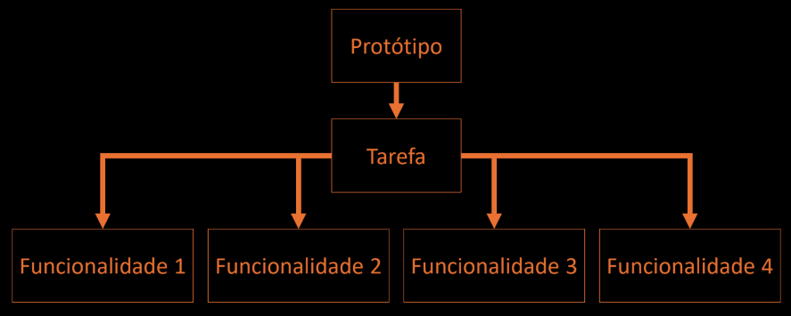
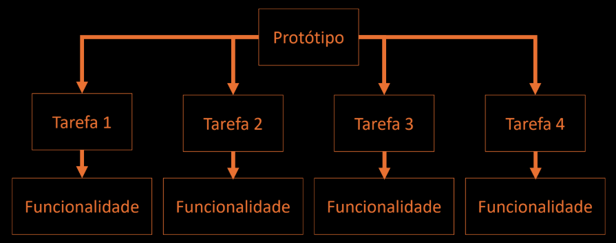

# Protótipos e Ecrãs

## Prototipagem
- Um **protótipo** é uma **representação** concreta, mas parcial, do **sistema** que pretendemos desenvolver e que permite aos utilizadores **interagirem** com este e **explorarem** a sua adequação.
- **Objetivo**: Permitir-nos obter **retorno sobre o desenho** do sistema interativo, o mais depressa possível.
- **Vantagens**:
    - Facilidade de construção
    - Várias alternativas
    - Baixo compromisso
    - Utilizadores são o foco
- **Características**:
    - **Abrangência** - Refere-se à fração de **tarefas** oferecidas pelo protótipo
    
    - **Profundidade** - Relacionada com a quantidade de **funcionalidades** que cada tarefa tem implementada
    

## Fidelidade vs Funcionalidade
- A **fidelidade** refere-se ao aspeto **visual** do protótipo (interface ou dispositivo físico), traduzindo a sua semelhança com o resultado final.
- A **funcionalidade** refere-se ao aspeto de **implementação**. Ou seja, existe ou não código para que exista execução computacional.

## Tipos de Protótipos
- **Cenários de Interação**
    - São **descrições** de utilizadores a realizarem as suas **tarefas**, usando um design específico da interface utilizador, para atingirem um determinado **resultado**, tendo em conta o **contexto** e um intervalo **temporal**.
    - *Ex:* O João dirigiu-se à nova máquina de venda de bilhetes, escolheu o sue destino carregando no **botão** correspondente ao Porto, depois selecionou um bilhete de ida e volta escolhendo a respetiva **opção**.
- **Storyboards**
    - São uma sequência de **desenhos** ou imagens que representam o modo como uma **interface** seria usada para completar uma determinada **tarefa**, complementando os **cenários de interação**. Cada um dos ecrãs contém apenas os **detalhes** importantes para a interação.
- **Protótipo de Papel**
    - São maquetas **físicas** da interface, feitos essencialmente em **papel**. São constituídos pelo **esboço** de várias partes, representando os **menus**, as **caixas de diálogo** ou outros elementos da interface.

## Desenho de Ecrãs
- Princípios base:
    - Proximidade
    - Alinhamento
    - Repetição
    - Contraste
    - Proporção
    - Ordenação
        - Ordem de leitura
        - Ordem de importância
        - Ordem alfabética
        - Sequência da tarefa
        - Frequência de utilização
        - Do geral para o particular
    - Espaço em branco
    - Decoração

**Resumo**
- Definimos o conceito de **protótipo**
- Vimos abrangência, profundidade, fidelidade e funcionalidade
- Temos vários **tipos** de protótipo
- Protótipos de **papel** são os mais vantajosos para o design
- Design é um processo criativo, mas existem **regras** base
- Vimos várias **princípios** importantes: proximidade, alinhamento, repetição, contraste, proporção, o espaço em branco, e a escolha correta de cores
- Vimos regras de **tipografia** e escrita de texto