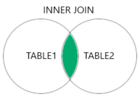
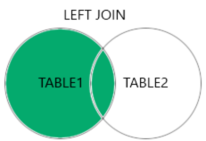
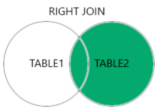
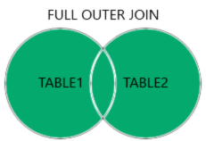

# Sistema de Informação (SI)
- Conjunto de componentes e processos que trabalham juntos para recolher, armazenar, processar, transmitir e apresentar informações de forma eficiente e eficaz.
- Objetivo principal: Fornecer informações precisas e atualizadas para apoiar as decisões e operações de uma organização.
- Hardware: Equipamentos físicos, dispositivos de armazenamento e dispositivos de rede.
- Software: Programas e sistemas operativos que executam as funções do SI.
- Base de Dados: Repositório de informações estruturadas ou não, organizadas que armazena e gere os dados do SI.
- Processos: Fluxos de trabalho e procedimentos que definem como od dados são recolhidos e processados.
- Pessoas: Ou utilizadores do SI que utilizam as informações fornecidas pelo SI para tomar decisões e executar "tarefas"

## Anatomia de um SI
- 3 Níveis
- Conceitos:
    - Host (Servidor)
    - Endpoint (Ponto de Rede)
    - Client/Server (Cliente / Servidor)
    - Linguagem programação (Java, Python)
    - Linguagem de marcação (HTML, Markdown)

# Diagramas de Entidade-Relacionamento (DER / ERD)
- Representações gráficas utilizadas para modelar e descrever a estrutura de uma base de dados relacional.
- Ferramenta importante para a análise, projeto e implementação de base de dados
- DER é composto por 3 elementos principais:
    - Entidades: Representam as tabelas da base de dados
    - Atributos: Representam as colunas das tabelas, que contêm os dados armazenados
    - Relacionamentos: Representam as relações entre as entidades
- Versões
    - Notação Crow's Foot
- Aplicações: Lucidchart, Creately, DBDiagram, ERDPlus, DrawSQL, QuickDBD, ER Draw Max, Draw.io

# Tipos de dados
- **Primitivos**: int, float, char, bool...
- **Compostos**: Arrays, Structures...
- **Classes**
- **Unions** { int i, float f }
- **Enums** { RED, GREEN, BLUE }
- **Specialized**: Datetime, time...

**Qual a necessidade?**

- **Precisão**: Cada tipo de dados tem as suas próprias espeficicações de precisão, o que significa que cada tipo de dados tem o seu próprio conjunto de regras para armazenamento e processamento de dados.
- **Tamanho**: Cada tipo de dados tem o seu próprio tamanho, o que significa que cada tipo de dados ocupa um espaço específico na memória.
- **Armazenamento**: Cada tipo de dados tem as suas próprias especificações de armazenamento, o que significa que cada tipo de dados é armazenado de uma forma específica.
- **Formato**: Cada tipo de dados tem o seu próprio formato, o que significa que cada tipo de dados é representado de uma forma específica.
- **Operações**: Cada tipo de dados tem as suas próprias operações permitidas, o que significa que cada tipo de dados pode ser usado para realizar operações específicas.

## Tipos de Dados (SQL Genérico)
- **Numéricos**
    - TINYINT / SMALLINT / MEDIUMINT / INT / BIGINT / FLOAT / DOUBLE / DECIMAL
- **Texto**
    - CHAR / VARCHAR / ENUM / SET
- **Data e Hora**
    - DATE / TIME / DATETIME / TIMESTAMP
- **Binário**
    - BINARY/VARBINARY/BLOB
- **GeoEspacial**
    - POINT / LINESTRING / POLYGON
- **Outros**
    - JSON / XML

# Chaves
- **Chaves Primárias (PK)** - Chave única que identifica uma linha numa tabela. É usada para distinguir uma linha da outra e é a chave que é usada para relacionar as tabelas.
- **Chaves Estrangeiras (FK)** - Chave que se refere à chave primária de outra tabela. É usada para estabelecer uma relação entre as tabelas.
- **Tipos de chaves**
    - **Simples** - Refere-se a uma coluna única numa tabela.
    - **Compostas** - Refere-se a mais de uma coluna numa tabela.

## Necessidade das Chaves

1. **Integridade dos Dados** - As chaves ajudam a garantir que os dados sejam consistentes e não contenham erros. A PK é usada para que não seja duplicada.
2. **Relacionamento entre tabelas** - As FK permitem que as tabelas sejam relacionadas entre si. Facilita a realização de consultas complexas.
3. **Garantia de consistência** - As chaves ajudam a garantir que os dados sejam consistentes e não contenham erros. Requisito para a confiabilidade dos dados.

# SQL
- SQL - Structured Query Language
- DDL - Data Definition Language - Define a estrutura da base de dados
    - **CREATE TABLE** - Cria uma nova tabela
    - **ALTER TABLE** - Modifica uma tabela existente
    - **DROP TABLE** - Remove uma tabela
- DML - Data Manipulation Language - Permite inserir, atualizar e excluir dados em tabelas
    - **INSERT INTO** - Insere novas linhas numa tabela
    - **UPDATE** - Modifica os valores em linhas existentes
    - **DELETE FROM** - Remove linhas de uma tabela
- DQL - Data Query Language - Permite consultar e recuperar dados de uma ou mais tabelas
    - **SELECT** - Extrai dados de uma ou mais tabelas
    - **WHERE** - Filtra os resultados de uma consulta
    - **JOIN** - Combina dados de duas ou mais tabelas
    - **GROUP BY** - Agrupa resultados de uma consulta
    - **HAVING** - Filtra os grupos criados com GROUP BY
- DCT - Data Control Language
- DTL - Data Transaction Language

## CRUD
- C - **Create**
- R - **Read**
- U - **Update**
- D - **Delete**

## Normas formais
- A normalização de tabelas em SQL é um processo fundamental para organizar dados de forma **eficiente** e **evitar** redundâncias e inconsistências.
- Garantir que as BDs sejam mais robustas, flexíveis e fácil de serem mantidas.
- Vantagens:
    - **Redução de redundância** - Evita a duplicação de dados, economiza espaço de armazenamento e facilitando a manutenção.
    - **Integridade dos dados** - Garante a consistência e a precisão dos dados.
    - **Flexibilidade** - Facilita a adição, remoção e modificação de dados, tornando a BD mais adaptável a mudanças.
    - **Melhoria no desempenho** - Queries SQL tendem a ser mais eficientes.

### 1ª Forma Normal (1NF)
- **Atomacidade** - Cada linha da tabela deve conter apenas um valor atômico e indivisível.
- **Chave Primária** - A tabela deve ter uma chave primária que identifique de forma única cada linha.
- **Não-repetição de grupos** - Não podem existir grupos de campos repetidos na mesma linha.

### 2ª Forma Normal (2NF)
- **Dependência total da chave primária** - Todos os atributos não-chave devem depender da chave primária inteira e não apenas de parte dela.

### 3ª Forma Normal (3NF)
- **Ausência de dependências transitivas** - Nenhum atributo não-chave deve depender de outro atributo não-chave.

### BCNF
- BC( Nome Autores )NF
- É uma melhoria da 3NF
- Uma tabela está em BCNF se, e somente se, para toda **dependência funcional X -> Y**, X for uma **superchave** da tabela.
- Superchave: Um conjunto de atributos que identifica de forma única uma linha de uma tabela.
    - Toda chave primária é uma superchave, mas nem todas as superchaves são chaves primárias.
 
## Views
1. SQL Views são consultas que são armazenadas como tabelas virtuais.
2. São criadas com uma query SQL.
3. São utilizadas para apresentar dados:
    - De uma forma organizada.
    - Mais fácil de entender.
4. Vantagens:
    - Limitar o acesso a dados sensíveis.
    - Melhorar a performance reduzindo a quantidade de dados que necessitam de ser processados.
    - Criar consultas complexas e apresentar os resultados de forma mais fácil de entender.
  
## Stored Procedures
- **Definição**:
    - **Blocos de código SQL** que ficam armazenados na base de dados.
    - Permitem encapsular lógica(s) e reutilizá-la.
    - Podem receber parâmetros e retornar resultados.
    - Melhoram o desempenho e a segurança das aplicações.
- **Vantagens**:
    - **Reutilização** - Facilita a manutenção e evita a duplicação de código.
    - **Abstração de lógica**
    - **Melhoria do desempenho** - Optimização do código pelo servidor e reutilização na execução.
    - **Aumento de segurança** - Evita SQL Injection.
    - **Redução do tráfego** - O código SQL é executado no servidor.
 
```sql
DELIMITER //
CREATE PROCEDURE inserir_novo_jogador (
    IN p_nome VARCHAR(100),
    IN p_posicao VARCHAR(50),
    IN p_data_nascimento DATE,
    IN p_nacionalidade VARCHAR(50)
)
BEGIN
    INSERT INTO jogadores (nome, posicao, data_nascimento, nacionalidade)
    VALUES (p_nome, p_posicao, p_data_nascimento, p_nacionalidade);
END //
DELIMITER ;
```
 
## Stored Functions
- **Definição**:
    - Calcular e retornar um único valor. Funções são projetadas para computações, transformações de dados, e lógica que resulta num único resultado.
    - Retorno de valores é **obrigatório**.
    - Retornar um único valor de um tipo de dado específico definido na declaração da função.
    - Funções deve ser determinísticas (para o mesmo conjunto de dados de entrada, devem sempre retornar o mesmo resultado).
    - São invocadas como parte de expressões SQL, em consultas SELECT, cláusulas WHERE, ORDER BY...
- **Vantagens**:
    - Mesmas que stored procedures.
    - Tipos de retorno definidos e validação de dados.
 
```sql
DELIMITER //
CREATE FUNCTION calcular_idade(id_jogador INT)
RETURNS INT DETERMINISTIC
BEGIN
    DECLARE idade INT;
    SELECT TIMESTAMPDIFF(YEAR, data_nascimento,
        CURDATE()) INTO idade
    FROM jogadores
    WHERE id = id_jogador;
    RETURN idade;
END //
DELIMITER ;
```

# Comandos SQL
```sql
/* Comentários são assim */
# Ou assim
-- Ou assim...

# Mostra uma descrição de como a query é corrida
EXPLAIN query;
```

## Tabelas - Operações Campos
```sql
# Criar tabela
CREATE TABLE tabela (atr1, atr2...);

# Modificar a tabela
ALTER TABLE tabela MODIFY COLUMN col1;

# Ver estrutura de uma tabela
DESCRIBE tabela;

# Listar tabelas
SHOW tables;
```

## Tabelas - Operações Registos
```sql
# Inserir registos na tabela
INSERT INTO tabela (atr1, atr2...) VALUES (val1, val2...)
```

### Selects
```sql
# Recolhe registos da base de dados
SELECT val1, val2 FROM tabela;

# Renomeia o output (sample)
SELECT * AS sample;

# Faz uma count ao resultado
SELECT count(*);

# Ordenar ascendente / descendente
SELECT * FROM tabela ORDER BY ASC|DESC;

# Agrupa por X
SELECT * FROM tabela GROUP BY id, nome;

# Limita o nº de registos da consulta
SELECT * FROM tabela LIMIT 3;
```

#### Joins
- **INNER JOIN** 
    - Só as linhas que possuem valores correspondentes em ambas as tabelas.
  
    ```sql
    SELECT Utilizadores.Nome, Encomendas.ID
    FROM Utilizadores
    INNER JOIN Encomendas
    ON Utilizadores.ID = Encomendas.ID;
    ```

    

- **LEFT OUTER JOIN**
    - As linhas da tabela da esquerda e as linhas correspondentes da tabela da direita.
    - Se não houver correspondência na tabela da direita, os valores serão null.
    ```sql
    SELECT Nome
    FROM Utilizadores
    LEFT OUTER JOIN Encomendas
    ON Utilizadores.ID = Encomendas.ID 
    ```
    
    
      
- **RIGHT OUTER JOIN**
    - Oposto do **LEFT OUTER JOIN**.
    - Retorna todas as linhas da tabela da direita e as linhas correspondentes da tabela da esquerda.
    - Para encontrar todos os registos da tabela da direita, mesmo que não existam registos correspondentes na tabela da esquerda.

    ```sql
    SELECT Utilizadores.Nome
    FROM Utilizadores
    RIGHT OUTER JOIN Encomendas
    ON Utilizadores.ID = Encomendas.ID;
    ```

    
  
- **FULL OUTER JOIN**
    - Combina os resultados do **LEFT** e **RIGHT OUTER JOIN**.
    - Retorna todas as linhas de ambas as tabelas, independentemente de haver correspondência entre elas.
    - Quando precisamos de todos os dados de ambas as tabelas, mesmo que não haja correspondência.

    ```sql
    SELECT Utilizadores.Nome, Encomendas.ID
    FROM Utilizadores
    FULL OUTER JOIN Encomendas
    ON Utilizadores.ID = Encomendas.ID;
    ```
 
    

- **CROSS JOIN**
    - Combina cada linha de uma tabela com cada linha da outra tabela, criando todas as combinações possíveis. CUIDADO!
    - Se existir 10 registo na tabela1, e 20 na tabela2, o cross join retorna $10 * 20 = 200$ registos.

    ```sql
    SELECT Utilizadores.Nome, Encomendas.ID
    FROM Utilizadores
    CROSS JOIN Encomendas;
    ```
    
## Tabelas - indices
```sql
# Cria um indice na tabela
CREATE INDEX idx ON tabela;
```
