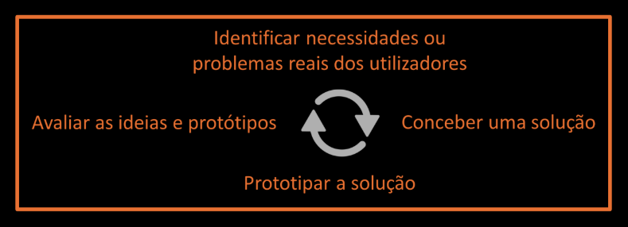
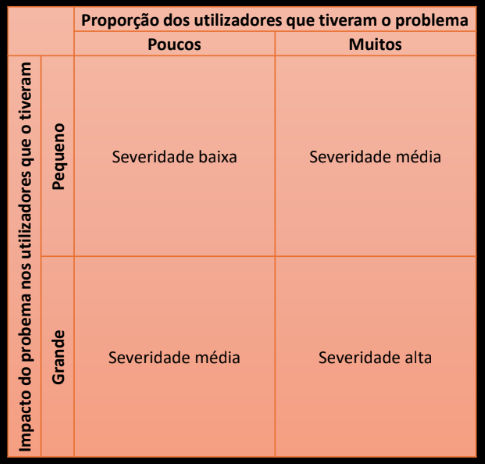
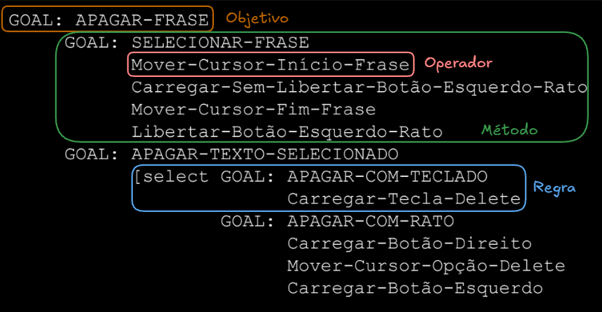
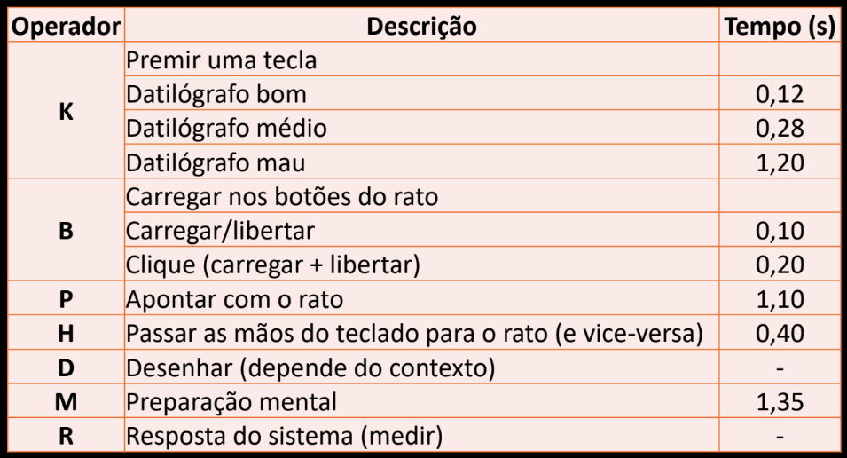

# Avaliação

## Tipos de avaliação

### Avaliação Analítica

Técnica de avaliação que não envolve utilizadores, recorrendo a peritos e métodos de inspeção (**avaliação pericial**) ou a modelos preditivos (**avaliação preditiva**) para avaliar a usabilidade do sistema.

**Métodos de inspeção** - Peritos - Identificar problemas - Sistema como um todo

**Métodos Preditivos** - Operações físicas e operações mentais - Aspetos específicos

### Testes com Utilizadores

Técnica de avaliação que envolve medir o **desempenho** e a **satisfação** de utilizadores típicos a realizarem tarefas típicas.

**Medidas de Desempenho** - Tempo gasto / erros cometidos

**Histórico de Interação** - Filmar / comentários / Logs

**Opiniões dos Utilizadores** - Questionários / entrevistas

**Tipos de estudos com utilizadores** - Estudos controlados / Estudos de campo
***

### Avaliação Formativa

***

### Avaliação Heurística

É uma técnica de **inspeção**, no qual os **peritos** em usabilidade verificam se a interface está de acordo com um conjunto de **princípios de usabilidade**, conhecidos como **heurísticas**.

1. Tornar o estado do sistema visível
2. Correspondência: Sistema e o Mundo Real
3. Utilizador controla e exerce livre-arbítrio
4. Coerência e adesão a normas
5. Evitar erros
6. Reconhecimento em vez de lembrança
7. Flexibilidade e eficiência
8. Desenho estético e minimalista
9. Ajudar o utilizador
10. Dar ajuda e documentação

#### Fases da avaliação heurística

1. **Treino Pré-avaliação**
  - A reunião de treino junta a **equipa de design** e os **avaliadores**. Na reunião apresenta-se a **aplicação** que vai ser avaliada, descreve-se os potenciais **utilizadores** que a vão usar, as principais **funcionalidades** que esta irá oferecer e os **cenários de utilização**.
2. **Avaliação**
  - Cada avaliador **analisa** a interface **separadamente** dos outros avaliadores, registando os **problemas** encontrados. Esta avaliação individual é importante para garantir que temos avaliações **independentes** que não foram afetadas pelas avaliações de outros avaliadores.
  - **Listar um problema**:
    - Designação do problema: Descrição breve do que é o problema
    - Heurística ou heurísticas violadas - Enumerar o nome das heurísticas violadas
    - Descrição do problema - Justificação de como é que a heurística é violada
    - Proposta de correção - Solução possível para resolver o problema encontrado
    - Grau de severidade - Traduz a gravidade do problema para a tarefa
    - Imagem da interface - Problema assinalado
3. **Consolidação**
  - Consiste em **juntar os problemas identificados** pelos vários avaliadores numa única lista de problemas. Esta junção pode ser feita apenas pelos avaliadores ou em conjunto com a equipa de design.
  - Processo de consolidação:
    1. Converter os vários problemas num só
    2. Juntar as várias descrições do problema numa única descrição mais completa
    3. Calcular a média das severidades e usá-la como a severidade final do problema
4. **Balanço**:
  - A equipa de design, os observadores e os avaliadores juntam-se outra vez para **discutirem** os resultados da avaliação. Esta reunião de balanço serve para **debater possíveis soluções** para os problemas de usabilidade encontrados, focando-se principalmente naqueles com severidades mais elevadas.

**Escala de Severidade**:
- 0 - Não é ou não existe consenso entre os avaliadores.
- 1 - **Problema estético apenas** - Não precisa de ser resolvido, a não ser que ainda existam tempo e recursos.
- 2 - **Problema de usabilidade menor** - Deve ser dada uma baixa prioridade à sua correção.
- 3 - **Problema de usabilidade maior** - É importante que seja corrigido, logo deve atribuir-se uma prioridade elevada à sua resolução.
- 4 - **Catástrofe de usabilidade** - É imperativo corrigir este problema antes de lançar o produto.

***

### Avaliação Preditiva

Como a avaliação heurística, a avaliação preditiva também permite avaliar um sistema **sem recorrer a utilizadores**. Para isso recorre a **modelos cognitivos e físicos** que conseguem estimar quanto tempo é que uma pessoa leva a realizar uma determinada tarefa.
***

### Modelo GOMS

Modelo GOMS (Goals, Operators, Methods, Selection Rules) foi desenvolvido numa tentativa de modelar o **conhecimento** e o **processo cognitivo** envolvidos enquanto os utilizadores **interagem** com o sistema.

Consiste num **objetivo de alto nível**, decomposto numa sequência de **tarefas unitárias** (subobjetivos), podendo cada uma delas ser decomposta em **operadores básicos**.

Exemplo:

***

### Modelo KLM

Considera que os utilizadores são **peritos** e encontra-se relacionado com o GOMS, podendo ser visto como um **GOMS de muito baixo nível** em que **o método é dado**. O modelo decompõe a fase de execução em cinco operadores **físico-motores**, um operador **mental** e um operador relacionado com a resposta do **sistema**.

**Operadores KLM**

K - Premir uma tecla
B - Carregar num botão do rato
P - Apontar e mover o rato (dispositivo) para um alvo
H - Localizar o rato ou teclado
D - Desenhar linhas usando o rato
M - Preparação mental para realizar uma ação física
R - Resposta do sistema às ações do utilizador

***

### Avaliação com Utilizadores

#### Testes com utilizadores

Técnica de avaliação que envolve medir o **desempenho** e a **satisfação** de utilizadores típicos a realizarem tarefas típicas.
***

### Planeamento dos testes

#### Plano Experimental

É um **documento** a ser usado pela equipa de design para planear os testes com utilizadores. Este documento permite a **discussão entre os elementos** da equipa de design para chegarem a acordo sobre o **que se pretende com os testes**, como é que estes irão decorrer e o que se vai obter.
1. Objetivo
2. Onde
3. Quando
4. Duração
5. Equipamento
6. Software
7. Estado
8. Tempo de Resposta
9. Coordenador e Observador
10. Utilizadores
11. Tarefas
12. Fim correto
13. Ajuda
14. Ajudar
15. Dados
16. Sucesso

#### Guião Experimental

É **usado pela equipa de design** durante as sessões de testes, e é **criado com base no plano** experimental. Tipicamente, o coordenador usa este guião para conduzir a sessão de testes. Tipicamente, o coordenador usa este guião para conduzir a sessão de testes.
O objetivo principal é garantir que **todos os utilizadores realizam os testes nas mesmas condições** e fazem as mesmas coisas. A existência deste guião permite ainda, a qualquer membro da equipa de design, ser capaz de realizar a sessão de testes.
1. Introdução e objetivos
2. Formulário de consentimento
3. Questionário pré-teste
4. Tarefas
5. Questionário pós-teste
6. Entrevista

#### Tarefas e medidas de usabilidade

**Cenários de Tarefas**

O conteúdo dos cenários deve ser **equilibrado**, no sentido em que deve dar a **informação suficiente** para os utilizadores não terem de adivinhar o que é suposto fazer e, por outro lado, **não deve dar informação em demasia** que lhes diga como fazer a tarefa. Usa-se os **cenários de atividade** e de **interação como base**.

**Medidas de usabilidade**
- Tempo
- Erros
- Tarefas
- Clicks
- Satisfação

#### Testes-Piloto

Conseguimos eliminar **tempos mortos** que possam existir, alterar partes que estejam **confusas** na explicação do sistema, descobrir **tarefas inexequíveis**, **ajustar os tempos** reservados para cada tarefa, **rever as perguntas** do questionário e ainda praticar os papéis de **coordenador** e **observador** da sessão de testes.

**Fases da sessão de testes**
1. Preparação - Garantir que está tudo em ordem para iniciar.
2. Introdução - Apresentação ao utilizador, garantir o conforto, tutorial, dar instruções claras do que é para fazer e formulário de consentimento.
3. Realização - Indicar as tarefas através do guião, apontar desempenho, ideias, problemas...
4. Balanço - Questionário pós-teste, conversa informar para obter feedback, desenvolver um relatório.

#### Questionários de Usabilidade (SUS)

É um dos questionários mais usados para avaliar a **usabilidade percecionada** de um sistema. É independente da tecnologia e já foi aplicado a dispositivos físicos, aplicações computacionais, sites web, telemóveis... O questionário é composto por **dez itens** e cobre uma variedade de **aspetos de usabilidade** do sistema.

Escala de 1 (Strongly Disagree) até 5 (Strongly Agree)

**Perguntas**:
1. Penso que gostaria de utilizar este sitema com frequência.
2. Achei o sistema desnecessariamente complexo.
3. Considero o sitema fácil de utilizar.
4. Penso que necessitaria do apoio de uma pessoa técnica para poder utilizar este sistema.
5. Considero que as várias funções deste sistema estão bem integradas.
6. Considero que existe demasiada incoerência neste sistema.
7. Imagino que a maioria das pessoas aprenderia a utilizar este sistema muito rapidamente.
8. Achei o sistema muito complicado de utilizar.
9. Senti-me muito confiante na utilização do sistema.
10. Precisei de aprender muitas coisas antes de poder utilizar este sistema.

#### Outros questionários
- SEQ - Medir a satisfação de desempenho de uma tarefa.
- TAM - Medir a aceitação da tecnologia.
- ASQ - Medir a satisfação em relação à facilidade.
- CSUQ - Avaliar um sistema em termos globais.
- UEQ - Avaliar rapidamente a experiência de utilização.
- SUPR-Q - Avaliar especificamente sites Web.
