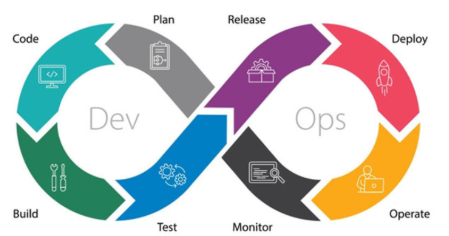
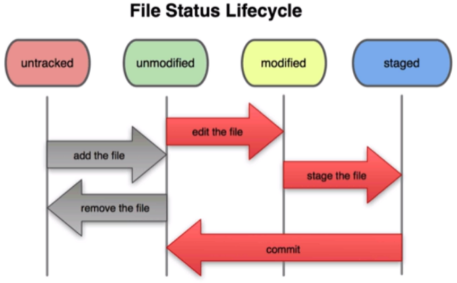
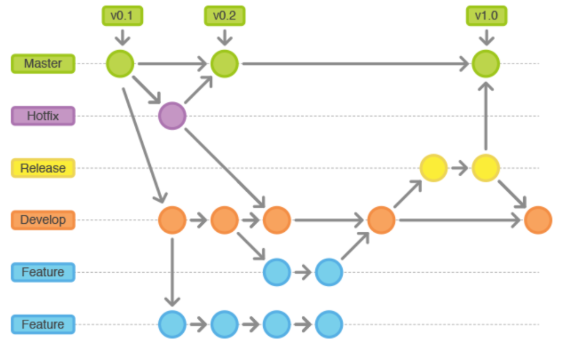

# Desenvolvimento Ágil de Software
O **desenvolvimento ágil de software** surgiu como uma resposta às limitações dos métodos tradicionais, que têm dificuldades em lidar com mudanças rápidas, cumprir prazos e optimizar recursos de forma eficaz.
Com foco na **flexibilidade e na colaboração**, essa abordagem transforma a produção de software num **processo mais dinâmico**, centrado nas **necessidades dos usuários**, por meio de **entregas frequentes, ajustes constantes** e maior eficiência.
Ao adotar os princípios da agilidade, as organizações **modernizam as suas práticas**, promovem uma cultura de **adaptação contínua** e **fortalecem a colaboração** entre as equipas.

## Principais características
- **Entrega frequente e incremental** de funcionalidades.
- **Colaboração próxima** entre developers, clientes e outros stakeholders.
- **Adaptabilidade a mudanças** mesmo em fases avançadas do projeto.
- Foco em **software funcional** ao invés de documentação extensa.
- Equipas **auto-organizadas** e comunicação constante.

## Principais metodologias ágeis
- **Scrum**
- **Kanban**
- **Extreme Programming (XP)**

## Tradicional vs Ágil
### Tradicional
- **As funcionalidade são definidas desde o inicio e não mudam**
- O projeto é planeado para entregar **tudo o que foi especificado**, o que exige controlar o prazo e o custo - mesmo que isso **comprometa a qualidade**
- A abordagem tradicional tenta eliminar riscos por meio de **planeamento detalhado e previsibilidade**

### Ágil
- O cliente e a equipa decidem juntos o que cabe **dentro de um prazo e orçamento fixos**
- O que é entregue pode mudar conforme as **prioridades e aprendizados do projeto**
- A **qualidade é preservada**, porque o foco está em entregar valor continuamente e com excelência, mesmo que nem todas as funcionalidades inicialmente desejadas sejam entregues

<table>
<tr><th>Aspeto<th>Tradicional<th>Ágil
<tr><th>Planeamento<td>Extensivo e antecipado<td>Iterativo e adaptativo
<tr><th>Flexibilidade<td>Baixa (mudanças são más)<td>Alta (mudanças são bem-vindas)
<tr><th>Qualidade<td>Pode ser sacrificada<td>É prioridade constante
<tr><th>Entregas<td>No final do projeto<td>Frequentes e incrementais
</table>

## DevOps
**DevOps** é uma cultura e um conjunto de práticas que integram as equipas de **desenvolvimento (Dev)** e **operações (Ops)**, com o objetivo de:
- Automatizar e integrar os processos de desenvolvimento e entrega de software
- Reduzir o tempo entre o desenvolvimento de uma funcionalidade e a sua release
- Garantir mais **qualidade, velocidade e confiabilidade** nas entregas

## Visão de Governança de TI e Desenvolvimento de Software
<table>
<tr><th>Nível<th>Model<th>Função
<tr><th>Estratégico<td><b>EAP</b> - Enterprise Architecture Planning<td><b>Planeamento estratégico</b> da arquitetura corporativa de TI (processos, dados, aplicações, tecnologia)
<tr><th>Táctico<td><b>ALM/ADLM</b> - Application (Development) Lifecycle Management<td>Gestão do <b>Ciclo de Vida das Aplicações</b> ADLM amplia o ALM ao incluir práticas ágeis, automação, integração contínua e colaboração DevOps, alinhando-se à estratégia
<tr><th>Operacional<td><b>SDLC</b> - Software Development Life Cycle<td>Processo de desenvolvimento de Software (com fases como planeamento, análise, design, construção, testes, entrega e manutenção)
<tr><th>Técnico/Ágil<td><b>ADML/AML</b> - Modelagens e Execução<td>Modelagem Ágil de Dados (ADML) e Sistemas (AML) (Ferramentas/metodologias específicas que suportam o SDL e ALM/ADLM)
<tr><th>Técnico/Ágil<td><b>DevOps</b> - Modelagens e Execução<td>Práticas de entrega, automação, integração, deploy e operação contínua
</table>

### SDLC - Software Development Life Cycle
- O conceito de **SDLC existe há anos** e surge devido á crescente complexidade da gestão de projetos de desenvolvimento de software e à natureza inerente das entregas de software - que precisam de ser continuamente alteradas e atualizadas
- SDLC foi projetado para **controlar projetos de desenvolvimento** e adicionar **previsibilidade**, com o objetivo de entregar maior valor.
- Concebido para seguir uma abordagem mais **estruturada** e **incremental** - model em cascata/ modelo V

### ADLM - Application Development and Lifecycle Management
- Define especificamente como a gestão da parte do "desenvolvimento" da vida de um aplicativo e no qual elementos-chave são incluídos, como:
    - Definição e gestão de requisitos de software
    - Gestão de configuração e mudança de software
    - Planeamento de projetos de software com foco no planeamento ágil
    - Gestão de itens de trabalho
    - Gestão de qualidade
    - Gestão de defeitos
- Metodologias ágeis como o Scrum ou Kanban são frameworks de implementação do SDLC, e o ADLM é a gestão do ciclo de vida do software quando as metodologias ágeis são implementadas
- Com o ADLM, as metodologias ágeis têm precedência e, como resultado, atividades como gestão de configuração e mudanças de software e gestão de defeitos desempenharem um papel mais vital no desenvolvimento de software. O método ágil dá maior ênfase à capacidade não apenas de gerenciar mudanças de software, mas também adotá-las.

### EAP (EAPT) - Enterprise Agile Planning (Tools)
- Expande o conceito de ADLM, que vai do uso do Agile no nível de equipa/projeto para a implementação da filosofia Agile em escala, a fim de alcançar o desenvolvimento Agile de nível empresarial com o objetivo de gerar maior valor para toda a empresa e não apenas para a equipa.
- Auxilia na gestão do ciclo de vida do desenvolvimento quando metodologias como Agile e outras são implementadas para gerenciar o desenvolvimento de software ágil em escala empresarial, utilizando recursos-chave como:
    - Gestão de Portfólio de Projetos
    - Integração com Service Desk
    - Planeamento Ágil (classe corporativa)
    - Gestão de Backlog Ágil
    - Gestão de Lançamentos
- EAP é a gestão do ciclo de vida do desenvolvimento, quando metodologias ágeis em escala são implementadas numa organização

### DevOps
- DevOps visa preencher a lacuna entre a criação, a implementação e o uso do software.
- Atividades como integração e implementação contínua (CI/CD) e gestão de lançamentos são consideradas parte de DevOps.
- A ideia por trás de DevOps é entregar valor. DevOps coloca o valor do esforço de desenvolvimento nas mãos daqueles que podem fazer o melhor uso dele, em vez de optimizar inerentemente o processo de desenvolvimento. DevOps é agnóstico em relação à metodologia de desenvolvimento utilizada.

### ALM - Application Development and Lifecycle Management
- ALM abrange tudo, desde o nascimento ou concepção de uma aplicação até ao fim da sua vida.
- SDLC, ADLM, EAP e DevOps são todos parte e subconjunto do ALM, onde SDLC, ADLM e EAP concentram-se na gestão do lado do desenvolvimento, enquanto o DevOps concentra-se na gestão da segunda metade do ciclo de vida: lançamento, monitoramento e manutenção.
- ALM concentra-se mais em colaboração multifuncional, rastreabilidade e conformidade do ciclo de vida, reutilização avançada de ativos e gestão de variantes, riscos e segurança de aplicações.

### Etapas no ciclo de vida de uma aplicação
As etapas no ciclo de vida de uma aplicação são:
1. Especificação de requisitos
    - Envolve reunir e documentar os requisitos para o aplicativo. Inclui identificar as necessidades dos clientes finais, tal como identificar quaisquer requisitos funcionais e não funcionais.
2. Desenvolvimento
    - A aplicação é construída de acordo com as especificações do projeto. Inclui codificação, teste e depuração.
3. Testes
    - Após o desenvolvimento da aplicação, esta passa por testes rigorosos. Serve para garantir que esta atenda aos requisitos estabelecidos e funcione conforme esperado.
4. Implementação
    - Depois de testar e aprovar a aplicação, esta é implementada no ambiente de produção.
5. Manutenção
    - Envolve suporte e atualizações contínuas para garantir que a aplicação continua a responder às necessidades dos clientes finais.

## VCS (Version Control System)
**Sistemas de controlo de versão** têm como finalidade gerenciar versões de um documento/artefato.

**Tipos de VCS**:
1. VCS Locais
    - Ex: Computador com várias versões do documento
2. VCS Centralizados
    - Um **servidor central** e diversas áreas de trabalho, baseados na **arquitetura cliente-servidor**.
    - Atende muito bem a maioria das equipas de desenvolvimento de pequeno e médio porte, e que trabalhem numa rede local.
3. VCS Distribuídos
    - Cada área de trabalho tem o seu **próprio "servidor"**, ou seja, as operações de check-in e check-out são feitas na própria máquina.
    - As áreas de trabalho podem comunicar-se entre si.
    - Recomendados para equipas com muitos desenvolvedores e que se encontram em locais diferentes.

### Git - Sistema de controle de versão
- Trabalha com snapshots dos ficheiros no projeto.
- Tudo é verificado com CHECK-SUM com SHA-1.
- Quase todas as operações no Git são locais. Pode-se trabalhar offline sem problemas.

O Git tem 4 estados principais em que os ficheiros podem estar:
1. **Untracked** - Normalmente ficheiros novos, que o git ainda não os tocou.
1. **Commited** - Os dados estão armazenados de forma segura localmente.
2. **Modified** - O ficheiro foi alterado, mas não se fez o **commit** localmente.
3. **Staged** - A vesão atual de um ficheiro modificado vai fazer parte do próximo commit.

**Git Flow**

#### Ramificação do Git - Branches
TODO Slide 191

#### Comandos GIT
**git init** - Inicializa um repositório git
**git status** - Visualizar o estado dos ficheiros do repositório
**git config** - Configurar o git
**git add** - Adiciona ficheiros ao repositório
**git commit -m "Fix"** - Confirma as alterações no repositório
**git log** - Mostra todos os commits do repositório
**git show** - Mostra o último commit, em detalhe
**git diff** - Mostra as modificações dos ficheiros
**git checkout "filename"** - Reverter as alterações feitas num ficheiro
**git reset HEAD "filename"** - Retira o ficheiro da área de staged para o ponto anterior
**git reset --hard "hash"** - Retorna tudo como estava antes do commit
**git blame "ficheiro"** - Exibe quem modificou cada linha de um ficheiro, incluindo data e commit