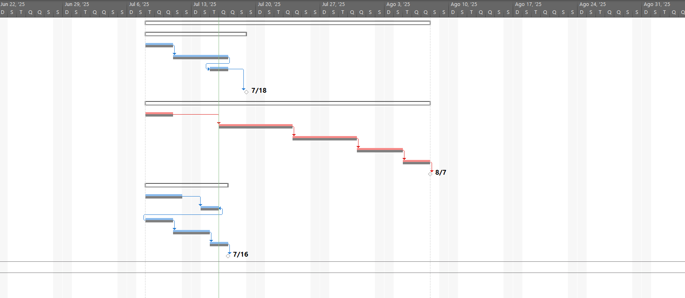
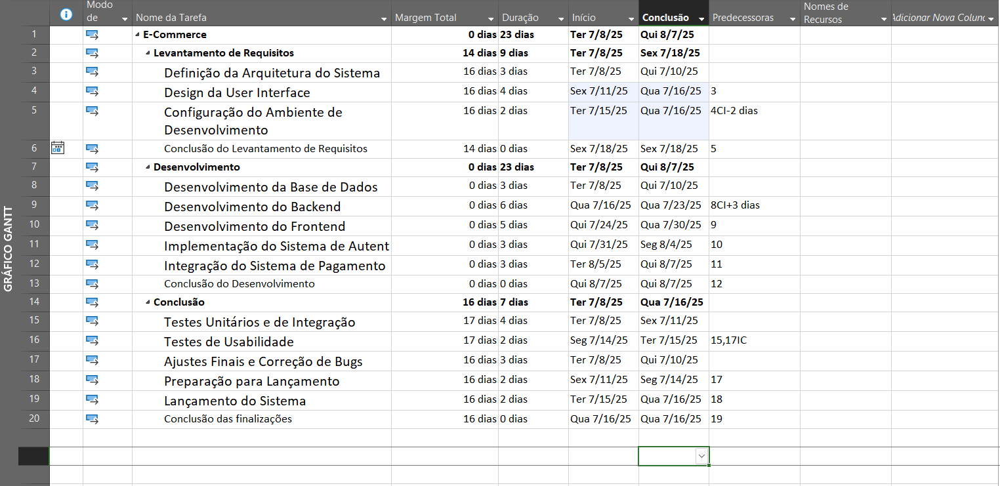

# Microsoft Project

## Calendários
* Tipos de calendários:
    * Global - Para todos os projetos.
    * Específico - Do projeto em questão.
    * Mais específico - De cada um dos rescursos.
* Devem ser a 1ª coisa a ser definida.
* Afeta todo o planeamento do projeto.
* Refaz o planeamento se existirem alterações durante a execução do projeto.
* Mostra o impacto REAL das alterações na data de fim do projeto.

## WBS - Work Breakdown Structure
* Atribuição de códigos às tarefas
    * Útil para identificar várias tarefas que podem ter o mesmo nome
    * Mostra a coluna do WBS

# Gantt

## Tarefas
* Podem ser Manuais ou automáticas.

* **Milestone** - Espécie de "checkpoint" no desenvolvimento.
* **Sumário** - Servem para agrupar tarefas

* Encontrar uma tarefa no Gantt:
    1. Clicar no nome da tarefa
    2. No menu "Task", clicar no ícone "Scroll to task"

* Ligar tarefas sequencialmente:
    1. Marcar o grupo de tarefas que se quer colocar em sequência
    2. Clicar no botão que fica no menu Task (parece uma corrente)

### Dependências
* Tipos de ligações entre tarefas:
    * **FS (Finish to Start)** - A 2ª só pode começar depois da 1ª acabar
    * **FF (Finish to Finish)** - A 2ª só pode acabar depois da 1ª acabar
    * **SS (Start to Start)** - A 2ª só pode começar depois da 1ª começar
    * **SF (Start to Finish)** - A 2ª só pode acabar depois da 1ª começar

### Constrangimentos (Constraints)
* Inserir uma pausa entre tarefas, ou começar uma antes da anterior terminar.
* **Lag** (Pausa no final)
    * A próxima tarefa só pode começar depois da pausa no final da tarefa corrente.
    * É um valor **positivo**.
* **Lead** (Para o início)
    * Se o valor do **Lag** for **negativo**, a tarefa vai-se **sobrepor** ao final da anterior.

* Menu "View":
    1. Marcar "Details"
    2. Escolher "More Views..."
    3. Escolher "Task Details From"

## Caminho crítico
* É constituído pelas tarefas que determinam o fim do projeto.
    * Caso alguma delas se atrase, o projeto termina mais tarde.
    * O caminho crítico pode ser alterado no decurso da execução do projeto.

## Slack (Folga)
* Tipos de slack:
    * **Positivo** - A tarefa pode-se atrasar, que não tem impacto na data do fim do projeto.
    * **Nulo** - A tarefa faz parte do caminho crítico.
    * **Negativo** - A tarefa já está atrasada, face ao previsto inicialmente.

## Filtos
* Menu "View" - "Filter" - Dá para escolher vários tipos de filtro.

## Baseline
* Serve para gravar o planeamento original, antes de passar à fase de execução.
    * Grava o início, fim e duração de cada tarefa, recursos envolvidos, etc...
    * Pode-se gravar várias baselines, para ir controlando o desenvolvimento do projeto (máx 11 baselines).

* Definir a baseline
    * Menu "Project" - Opção "Set Baseline"

* Mostrar a baseline no Gantt
    * Menu "Gantt Chart Format" - Opção "Baseline"