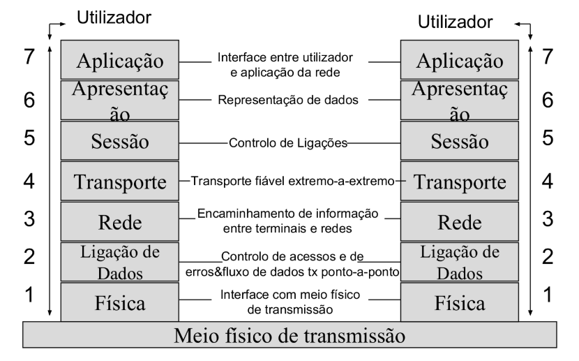

# 2 - Introdução aos Protocolos
**Protocolos**:
- São regras para possibilitar a comunicação entre diferentes elementos de rede, mesmo com possíveis diferentes formas de representar a mesma informação. Ex: Suportar a comunicação entre elementos de rede de diferentes fabricantes

## 2.2 - Estrutura de mensagens de protocolos
Objetivos da segmentação de dados (na Origem A) em pacotes mais pequenos:
- Redução dos atrasos de tempo de transmissão
- Redução da ocupação de recursos da rede. Ex: Buffers de nós
- Adaptação a formato de protocolos de camadas inferiores
- Possibilidade de intermediar pacotes de diferentes utilizadores
- Cumprir requisitos de dimensão máxima de mensagens nas redes (MTU - Maximum Transmission Unit)

**Cabeçalhos**
- Campo com informação de controlo dos protocolos anexada a campo dados
- Necessários para novos pacotes após divisão de dados na Origem
- Maior complexidade - Introdução de mais informação de controlo
    - Menor tamanho de pacotes - Maior % de informação de controlo (cabeçalho)
    - Convém existir compromisso entre tamanho de campos de dados e cabeçalho
- Terminal Destinatário efetua reagrupamento de informação dividida na Origem + remoção de cabeçalhos de camadas inferiores

## 2.3 - Modelo OSI (Open Systems Interconnection)

## 2.4 - O Modelo TCP/IP
**Modelo TCP/IP** - Usado em redes IP externa (internet) ou internas (intranets)
- Camadas 7&6&5 de OSI concentradas numa única camada de aplicação

## 2.5 - Os standards IEEE

### 2.5.1 - Os standards IEEE / Ethernet
Ethernet: Norma 802.3 IEEE para LANs
- Define tecnologia inicialmente mais utilizada em LANs:
    - Efetua controlo de erros (LLC) e acesso a meio de transmissão (MAC)
    - Suporta diferentes topologias e meios de transmissão - Inicialmente utilizada apenas com topologia Bus e cabos de cobre (LANs)
    - Baixo custo
    - Fácil de implementar e gerir
- Flexível: Evoluiu para também suportar outras topologias, redes maiores e meios de transmissão mais rápidos (atualmente mais usados)
    - Topologia Estrela
    - Redes MANs e WANs com Gigabit Ethernet
    - Meios de transmissão fibra ótica
- Usa CSMA (Carrier Sense Multiple Access) / CD (Collision Detection) para controlo de acesso a rede com meio de Tx partilhado half-duplex
    - CSMA - Terminais escutarem meio de Tx para só transmitirem quando este estiver livre
    - CD - Reforçar sinal de colisão para melhor ser ouvido por todos os terminais de uma LAN (ex: Bus) - Meio Tx ocupado até sinal de colisão ser removido da rede
        - Colisão acontece quando 2 terminais detetarem o meio de Tx livre em simultâneo -> podem transmitir as suas mensagens em simultâneo
