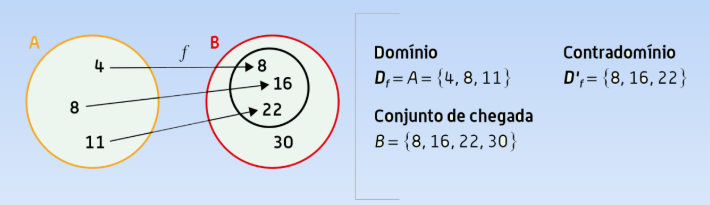
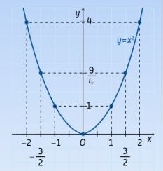

# Funções

## Definição de função
Dados os conjuntos A e B, define-se uma **função $f$ de $A$ em $B$**, quando a cada elemento de $x$ de $A$ se associa um único elemento de $B$, que se representa por $f(x)$.

**Exemplo**:

## Função Afim
Uma função definida por uma expressão algébrica do tipo $y = kx + b$ é uma **função afim**.

O parâmetro $b$ designa-se por **ordenada na origem** e o parâmetro $k$ é o **declive da reta** que representa gráficamente a função num referencial ortogonal e monométrico.

Se $b = 0$, a função é **linear**.
Se $k = 0$, a função é **constante**.
Se $k > 0$, a função é **crescente**.
Se $k < 0$, a função é **decrescente**.

As retas que representam gráficamente funções afins com o mesmo declive são **paralelas**.

## Funções quadráticas da forma $f(x) = ax^{2}$

Consideremos o polinómio, de grau 2, $ax^2 + bx + c$, com $a \ne 0$.
Se $b = 0$ e $c = 0$ então obtemos o monómio $ax^2$

À curva que representa a função chamamos **parábola**.
Ao ponto (0,0) chamamos **vértice** da parábola.

Se a > 0, a concavidade da parábola está voltada para cima.
Se a < 0, a concavidade da parábola está voltada para baixo.
